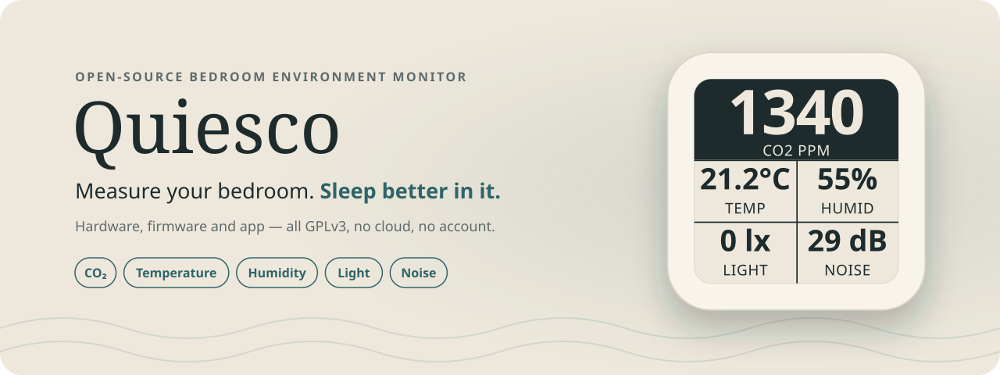
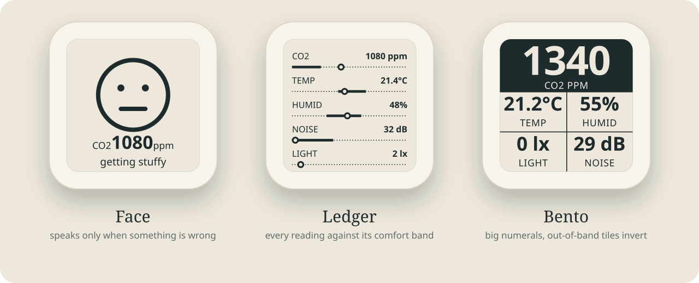
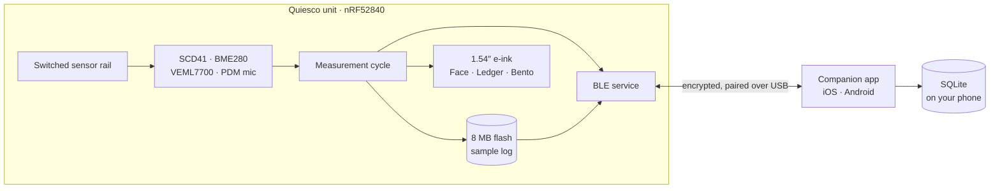
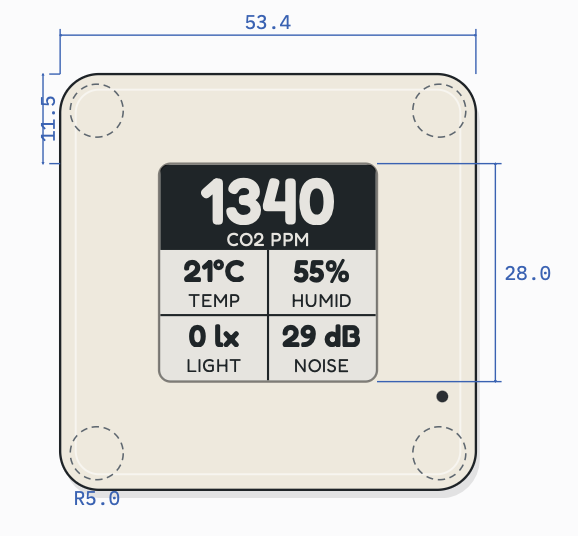

<div align="center">

<picture>
  <source media="(prefers-color-scheme: dark)" srcset=".github/assets/banner-dark.svg">
  
</picture>

<br><br>

[](LICENSE)
[](hardware/)
[](firmware/)
[](app/)
<br>
[](https://quiesco.rest/)
[](https://twitter.com/QuiescoRest)

**[Build your own](#-build-your-own)** · **[Hardware](hardware/)** · **[Firmware](firmware/)** · **[App](app/)**

</div>

---

Quiesco is a pocket-sized monitor made for the room you sleep in. It measures
**CO₂, temperature, humidity, light and noise**, shows them on an e-ink screen
that reads from across the room, and syncs every night to your phone over
Bluetooth. There is no Wi-Fi, no cloud and no account: your data stays yours.

Everything is open. This repository holds the PCB, the case, the firmware and
the companion app, so you can build one from scratch, reflash it from the
Arduino toolchain, or take it apart and make it your own.

Quiesco is a product of [Impossible Labs](https://impossiblelabs.xyz).

<picture>
  <source media="(prefers-color-scheme: dark)" srcset=".github/assets/screens-dark.svg">
  
</picture>

## Contents

- [Why Quiesco](#-why-quiesco)
- [What it measures](#-what-it-measures)
- [How it works](#-how-it-works)
- [Specs](#-specs)
- [Build your own](#-build-your-own)
- [Repository map](#-repository-map)
- [Roadmap](#-roadmap)
- [The story behind it](#-the-story-behind-it)
- [Contributing](#-contributing)
- [Licence](#-licence)

## 🌙 Why Quiesco

Environmental monitors have boomed: Aranet, Airvalent and friends made CO₂
tracking friendly. But they are general-purpose. They watch the air, and
little else, against office standards.

Quiesco is built for the **bedroom**. Light and noise matter as much as CO₂ and
temperature for a good night, so it measures all of them and judges each one
against a comfort band. Every reading is **actionable**:

| When it says… | …you can |
|---|---|
| CO₂ is high | open a window or run ventilation |
| too warm, too cold | adjust heating, cooling or bedding |
| too dry, too damp | humidify or dehumidify |
| too much light | close the blinds or wear a sleep mask |
| too loud | check the insulation or reach for earplugs |

And unlike commercial devices, it is **completely open and unlocked**: it runs
the Arduino bootloader, so you can change the firmware with the Arduino IDE or
your favourite editor.

## 📊 What it measures

| Reading | Sensor | Comfortable | Warn | Bad |
|---|---|---|---|---|
| CO₂ | Sensirion **SCD41** (photoacoustic NDIR) | ≤ 800 ppm | 800–1200 ppm | > 1200 ppm |
| Temperature | Bosch **BME280** | 20–26 °C | 18–20 · 26–28 °C | < 18 · > 28 °C |
| Humidity | Bosch **BME280** | 30–60 % | 25–30 · 60–70 % | < 25 · > 70 % |
| Noise | Knowles **SPH0641LU4H-1** PDM mic, dB(A) Leq over ~7 s | ≤ 55 dB | 55–70 dB | > 70 dB |
| Light | Vishay **VEML7700** | informational | | |
| Pressure | Bosch **BME280** | informational; also compensates CO₂ | | |

The same bands drive the e-ink screen and the app, so the phone and the panel
always agree. The full policy is in [`firmware/UI.md`](firmware/UI.md#3-comfort-bands).

## ⚙️ How it works



Every interval (1, 5, 10 or 30 minutes; default **5 minutes**) the unit powers
up its sensor rail, measures everything, applies your calibration offsets,
appends the reading to its on-board log, redraws the e-ink panel only if the
picture changed, then powers the rail down and sleeps. A sensor that fails is
reported as unavailable, and the cycle carries on without it.

The app pairs with a unit while it is on USB power, using a six-digit code
shown on the panel. After that it sets the clock, downloads the log, charts
each night and lets you pick the screen or calibrate the sensors.

## 📐 Specs

<p align="center">
  
</p>

| | |
|---|---|
| **MCU** | Nordic nRF52840 on a Seeed XIAO nRF52840 Plus module, Arduino bootloader |
| **Connectivity** | Bluetooth Low Energy, encrypted after pairing |
| **Sensors** | CO₂, temperature, humidity, pressure, light, noise |
| **Display** | GoodDisplay GDEW0154T8D, 1.54″ 152 × 152 e-ink, holds its image unpowered |
| **Storage** | Winbond W25Q64 8 MB SPI NOR flash (config + sample log) |
| **Power** | 3.7 V 280 mAh LiPo, USB-C charging, switched peripheral rail |
| **Expansion** | JST I²C and UART headers |
| **Case** | 3D-printable two-part enclosure, four M3 screws |

## 🛠 Build your own

A Quiesco takes an afternoon to put together once the parts arrive. Each step
links to the folder with the details.

### What you need

- The **PCBA**: the board from [`hardware/`](hardware/), ordered assembled
- A **GDEW0154T8D** 1.54″ e-ink panel (24-pin FPC)
- A **3.7 V 280 mAh LiPo** (303030) with a **JST SH 1.0 2-pin** lead
- A **3D-printed case** and **4 × M3×10 socket-head screws**
- A USB-C cable, a Mac or Linux machine, and a phone with Bluetooth

### Steps

Start by cloning the repository:

```sh
git clone https://github.com/OxMarco/Quiesco.git
cd Quiesco
```

1. **Order the board** → [`hardware/`](hardware/README.md#order-the-board)
   Send the Gerbers, BOM and pick-and-place files to a PCB assembly service.
2. **Print the case** → [`hardware/`](hardware/README.md#print-the-case)
   The STL is ready to slice; STEP files are there if you want to modify it.
3. **Assemble** → [`hardware/`](hardware/README.md#assemble)
   Seat the display, plug in the battery, close the case.
4. **Test the unit** → [`firmware/`](firmware/README.md#test-a-new-unit)
   Flash the factory test sketch and check every part reports `PASS`.
5. **Flash the firmware** → [`firmware/`](firmware/README.md#quick-start)
   `make build`, then upload over USB.
6. **Install the app** → [`app/`](app/README.md#run-it)
   Build it onto your phone, plug the unit into USB and pair.

> [!TIP]
> Only want to try the software? The app has a **Load sample data** option in
> development builds, so you can explore every screen without hardware.

## 🗺 Repository map

| Folder | What's inside | Read this |
|---|---|---|
| [`hardware/`](hardware/) | Altium sources, schematic PDF, Gerbers, BOM, pick-and-place, case STL/STEP | [hardware/README.md](hardware/README.md) |
| [`firmware/`](firmware/) | Arduino C++ firmware for the nRF52840, test sketches, host tests and tools | [firmware/README.md](firmware/README.md) |
| [`app/`](app/) | Expo / React Native companion app for iOS and Android | [app/README.md](app/README.md) |
| [`landing/`](landing/) | The [quiesco.rest](https://quiesco.rest) website (Astro) | [landing/README.md](landing/README.md) |

Going deeper:

- [`firmware/HARDWARE.md`](firmware/HARDWARE.md): the board as the firmware sees it, pin map, traps and debugging
- [`firmware/SOFTWARE.md`](firmware/SOFTWARE.md): firmware architecture and features
- [`firmware/UI.md`](firmware/UI.md): the e-ink screens, pixel by pixel
- [`firmware/src/protocol/PROTOCOL.md`](firmware/src/protocol/PROTOCOL.md): the BLE contract between unit and app
- [`firmware/WORKPLAN.md`](firmware/WORKPLAN.md): what's left before production

## 🧭 Roadmap

- [x] PCB v1, assembled and tested
- [x] Measurement cycle with all sensors, calibration and CO₂ forced recalibration
- [x] E-ink screens: Face, Ledger and Bento
- [x] Persistent sample log on the on-board flash
- [x] BLE protocol with pairing and encryption
- [x] Companion app: live reading, night charts, calibration
- [ ] BLE tested on air with iOS and Android
- [ ] Firmware updates in the field
- [ ] Measured power budget and battery life
- [ ] App on the App Store and Google Play
- [ ] Units for sale — *coming soon*

Progress is tracked milestone by milestone in [`firmware/WORKPLAN.md`](firmware/WORKPLAN.md).

## 📖 The story behind it

<details>
<summary>Why I built Quiesco</summary>

<br>

Despite having studied electrical engineering and physics, I never had the
chance to work on electronics outside of university. My main job for the past
few years has been in fintech, mostly on software architecture. Yet I have
always wanted to launch my own product.

I own an Airvalent and a couple of Xiaomi environmental sensors and had a
chance to review the Aranet too, yet I felt these little devices could
definitely do more. That's why, in early 2026, I decided to dedicate part of my
free time to building Quiesco from the ground up.

The choice of sensors was tough. There are clear contenders on the market, but
most come with obvious drawbacks, like relying on the BME280's self-heating
element for the primary temperature reading, or gas sensors that draw too much
current for a rather generic value like VOC. So temperature and humidity are
read from the SCD41, co-located with the CO₂ measurement.

**I wanted data that is actionable:** high CO₂ → ventilate; too much light →
wear a sleep mask; too much noise → check the acoustic insulation or use
earplugs.

</details>

## 🤝 Contributing

Issues and pull requests are welcome, from a typo to a new screen.

- **Firmware:** run `make verify` in `firmware/` before opening a PR; it checks
  the source policy and runs the host tests.
- **App:** run `npm test`, `npx tsc --noEmit` and `npx expo lint` in `app/`.
- **Protocol:** a change to the BLE contract touches both sides. Update
  [`PROTOCOL.md`](firmware/src/protocol/PROTOCOL.md), the firmware codec and
  the app's `src/protocol/` together; the golden vectors keep them honest.

## 🙏 Acknowledgements

Many thanks to the engineers at **PCBWay**, who helped tailor the PCB and the
enclosure to production standards.

## 📜 Licence

Quiesco is free and open source under the [GNU General Public License v3.0](LICENSE).
Third-party components are listed in
[`firmware/THIRD_PARTY_NOTICES.md`](firmware/THIRD_PARTY_NOTICES.md).

<div align="center">
<br>
<sub>Quiesco is a product of <a href="https://impossiblelabs.xyz">Impossible Labs</a> · <a href="https://quiesco.rest">quiesco.rest</a></sub>
</div>
