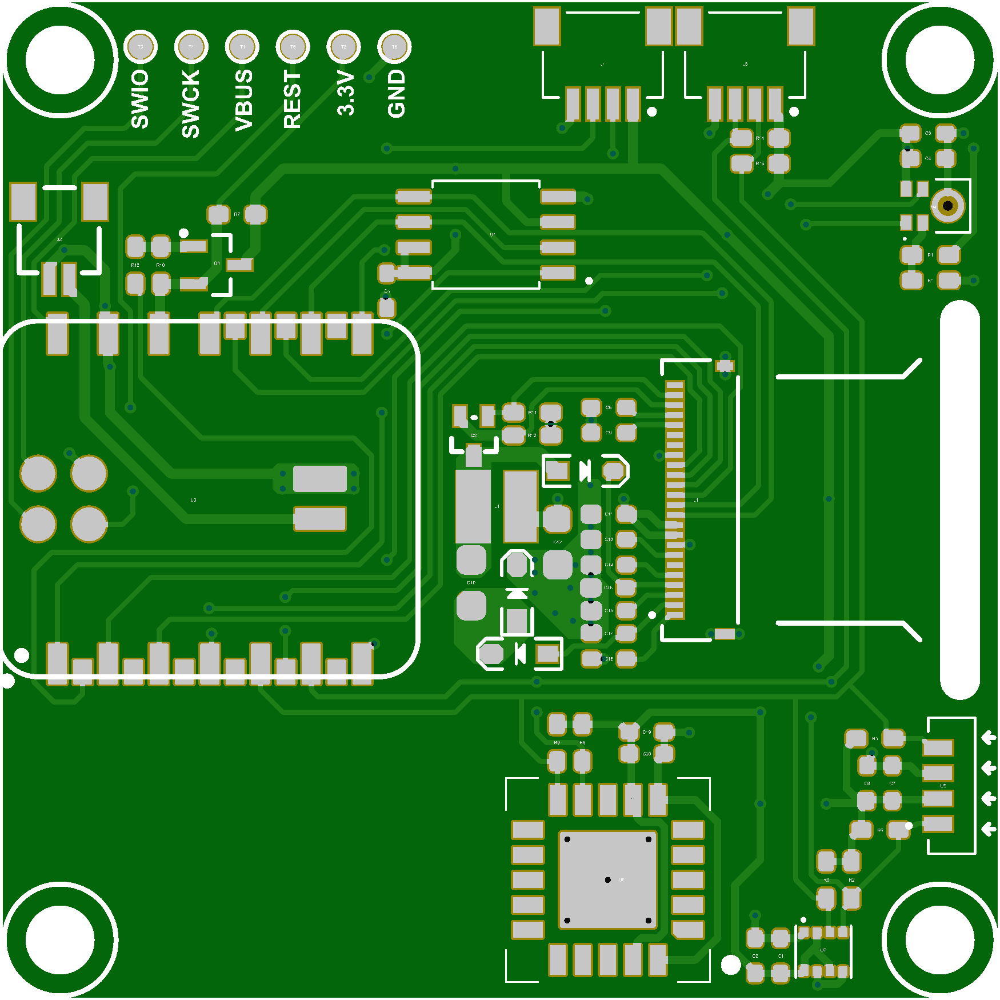
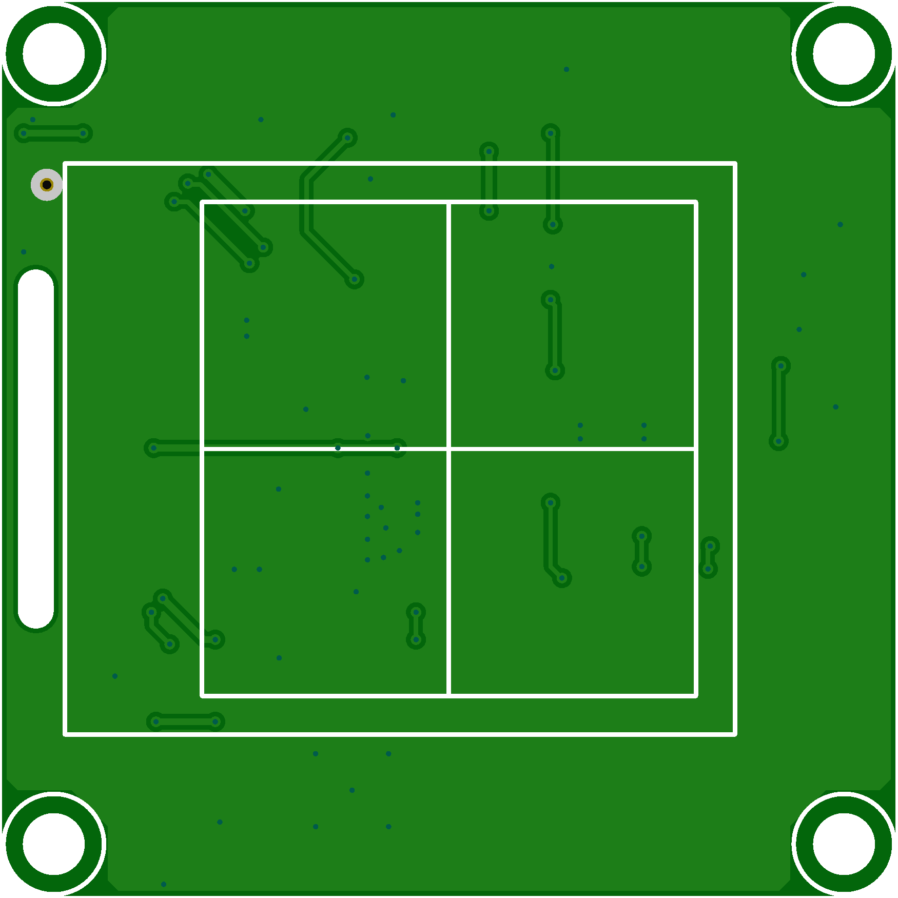

# Quiesco hardware

Everything you need to manufacture a Quiesco unit: the Altium project, the
fabrication and assembly outputs for PCB **v1** (`L-1K1W1007851A`), and the
3D-printable enclosure.

<table>
  <tr>
    <td align="center" width="50%"><br><sub><b>Top</b>: XIAO module, e-ink FPC, flash, SCD41, VEML7700, mic</sub></td>
    <td align="center" width="50%"><br><sub><b>Bottom</b></sub></td>
  </tr>
</table>

## Contents

- [The board at a glance](#the-board-at-a-glance)
- [Folder layout](#folder-layout)
- [Order the board](#order-the-board)
- [Parts not on the board](#parts-not-on-the-board)
- [Print the case](#print-the-case)
- [Assemble](#assemble)
- [Next: flash and test](#next-flash-and-test)

## The board at a glance

A two-layer PCB built around a **Seeed XIAO nRF52840 Plus** module, which
brings the MCU, Bluetooth radio, USB-C and LiPo charger. Every peripheral sits
on a **switched 3.3 V rail** that the firmware turns off between measurements.

| Ref | Part | Job |
|---|---|---|
| U3 | Seeed XIAO nRF52840 Plus | MCU, BLE, USB-C, LiPo charger |
| U6 | Sensirion SCD41-D-R1 | CO₂ (I²C `0x62`) |
| U2 | Bosch BME280 | temperature, humidity, pressure; pressure also compensates CO₂ (I²C `0x76`) |
| U5 | Vishay VEML7700 | ambient light (I²C `0x10`) |
| U4 | Knowles SPH0641LU4H-1 | PDM MEMS microphone |
| U1 | Winbond W25Q64JVSSIQ | 8 MB SPI NOR flash: config and sample log |
| J1 | 24-pin 0.5 mm FPC | GoodDisplay GDEW0154T8D e-ink panel |
| Q1 | AO3401 P-MOSFET | switched peripheral rail (`3V3ON`, active LOW) |
| Q2, L1, D1–D3 | SI1308EDL, 10 µH, MBR0530 | e-ink gate-voltage boost |
| J2 | JST SH 1.0, 2-pin | battery |
| J3 / J4 | JST 4-pin | I²C and UART expansion |
| T1–T6 | test pads | SWDIO, SWCLK, VBUS, RESET, 3.3 V, GND |

The pin map, power sequencing, bus details and known quirks are documented
from the firmware's point of view in
[`firmware/HARDWARE.md`](../firmware/HARDWARE.md).

> [!IMPORTANT]
> The fitted module is the plain **Plus**, not the **Sense Plus**: v1 has no IMU,
> and the board's own external mic (U4) is the only microphone.

## Folder layout

```text
hardware/
├── sources/                         Altium project
│   ├── L-1K1W1007851A.PrjPcb        project
│   ├── L-1K1W1007851A.SchDoc        schematic
│   ├── L-1K1W1007851A.PcbDoc        layout
│   ├── L-1K1W1007851A.pdf           schematic, printable
│   └── old/                         earlier schematic, for reference
├── assembly/                        what the factory needs
│   ├── gerber_L-1K1W1007851A/       Gerbers, drill files, IPC netlist
│   ├── bom_L-1K1W1007851A/          bill of materials (use bom-new.xlsx)
│   ├── coord_L-1K1W1007851A/        pick-and-place CSV
│   ├── PCB Manufacturing Process Specification.xlsx
│   └── L-1K1W1007851A_Top/Bottom.png  board renders
└── case/                            enclosure
    ├── case.STL                     ready to slice
    ├── L-1K1W1007851A_CASE.STEP     enclosure, editable
    ├── L-1K1W1007851A_ASM.STEP      full assembly with the PCBA
    └── … assembly instructions.docx
```

## Order the board

The v1 board was produced with PCBWay, but any assembly service that accepts
Altium Gerbers works.

1. **Zip the Gerbers.** Compress `assembly/gerber_L-1K1W1007851A/` into one
   archive and upload it as the PCB.
2. **Add assembly.** Upload `assembly/bom_L-1K1W1007851A/bom-new.xlsx` as the
   BOM and `assembly/coord_L-1K1W1007851A/Pick Place for L-1K1W1007851A.csv`
   as the centroid file.
3. **Share the process spec.** `assembly/PCB Manufacturing Process Specification.xlsx`
   holds the fabrication settings used for v1.
4. **Mind the not-fitted parts.** R1, R2, R3, R5, R6, R7, R8 and R9 are marked
   `NC` in the BOM and must stay empty: R1 would flip the microphone's
   channel, R7 is an unused rail bleeder, and the rest are per-sensor I²C
   pull-ups that the shared R14/R15 pair replaces.

## Parts not on the board

These ship loose and plug in during assembly (they are listed at the bottom of
the BOM):

| Part | Spec | Notes |
|---|---|---|
| E-ink panel | GoodDisplay **GDEW0154T8D**, 1.54″, 152 × 152, 24-pin 0.5 mm FPC | plugs into J1 |
| Battery | **3.7 V 280 mAh** LiPo, 303030 size | earlier docs said 500 mAh; that's wrong |
| Battery lead | **JST SH 1.0 2-pin**, 10 cm, single-ended | into J2 — **check polarity before plugging in** |
| Screws | **4 × M3×10** hex socket head | close the case |

## Print the case

The enclosure is a two-part shell, about **53 × 53 × 15 mm**.

- **Print** `case/case.STL` as-is.
- **Modify** `case/L-1K1W1007851A_CASE.STEP` in your CAD tool, and use
  `L-1K1W1007851A_ASM.STEP` to check clearances against the populated board.

If you change the window, re-measure how much of the panel it hides: the
screens leave a 7 px top inset for the v1 case (see
[`firmware/UI.md`](../firmware/UI.md#1-canvas)).

## Assemble

1. **Connect the display.** Open the J1 FPC latch, slide in the e-ink ribbon
   and close the latch. A badly seated ribbon shows up as missing rows in the
   factory test.
2. **Fit the battery.** Plug it into J2 and fix it to the case or the PCBA
   with double-sided tape.
3. **Seat the board in the lower shell.** Align the USB-C port with its
   opening first, then lower the board in.
4. **Close the case.** Make sure the microphone opening in the upper cover
   lines up with the hole on the PCBA, then drive in the four M3×10 screws.

## Next: flash and test

With the unit assembled, head to [`firmware/`](../firmware/README.md#test-a-new-unit)
to run the factory test sketch and flash the release firmware.

---

<sub>← Back to the [Quiesco overview](../README.md)</sub>
